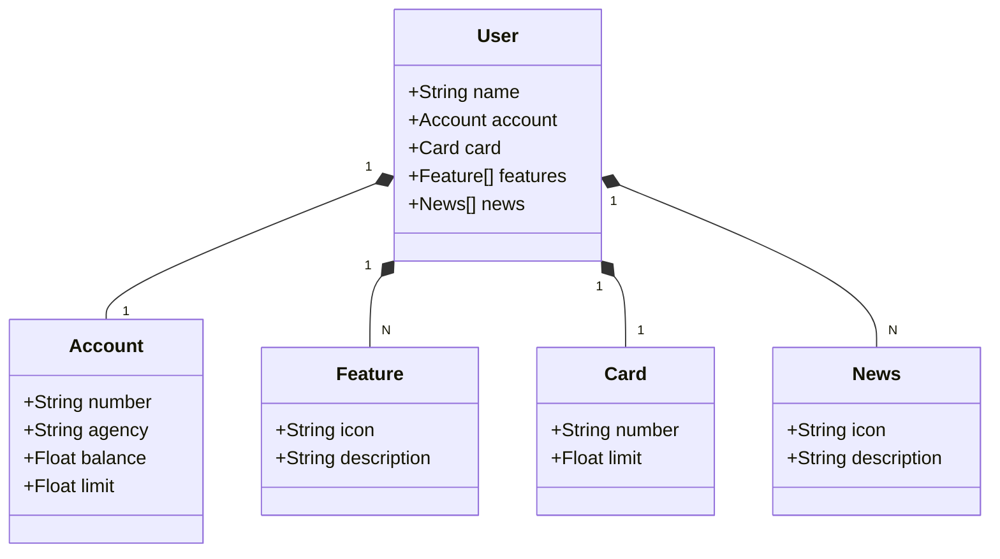

# Santander Dev Week 2024
Java RESTful API criada para a Santander Dev Week.

## TECNOLOGIAS UTILIZADAS:

-> Java 17: Usamos essa versão LTS do Java para tirar vantagem das últimas inovações que essa linguagem robusta e amplamente utilizada oferece;

-> Spring Boot 3: Usamos essa versão do Spring Boot, que maximiza a produtividade do desenvolvedor por meio de sua poderosa premissa de autoconfiguração;

-> Spring Data JPA: Exploraremos como essa ferramenta pode simplificar nossa camada de acesso aos dados, facilitando a integração com bancos de dados SQL;
-> OpenAPI (Swagger): Vamos criar uma documentação de API eficaz e fácil de entender usando a OpenAPI (Swagger), perfeitamente alinhada com a alta produtividade que o Spring Boot oferece;

-> Railway: facilita o deploy e monitoramento de nossas soluções na nuvem, além de oferecer diversos bancos de dados como serviço e pipelines de CI/CD.

## Diagrama de Classes

## DOCUMENTAÇÃO DA API (SWAGGER)

### [https://santander-dev-week-2024-api-prd.up.railway.app/swagger-ui/index.html]

Esta API ficará disponível no Railway por um período de tempo limitado
